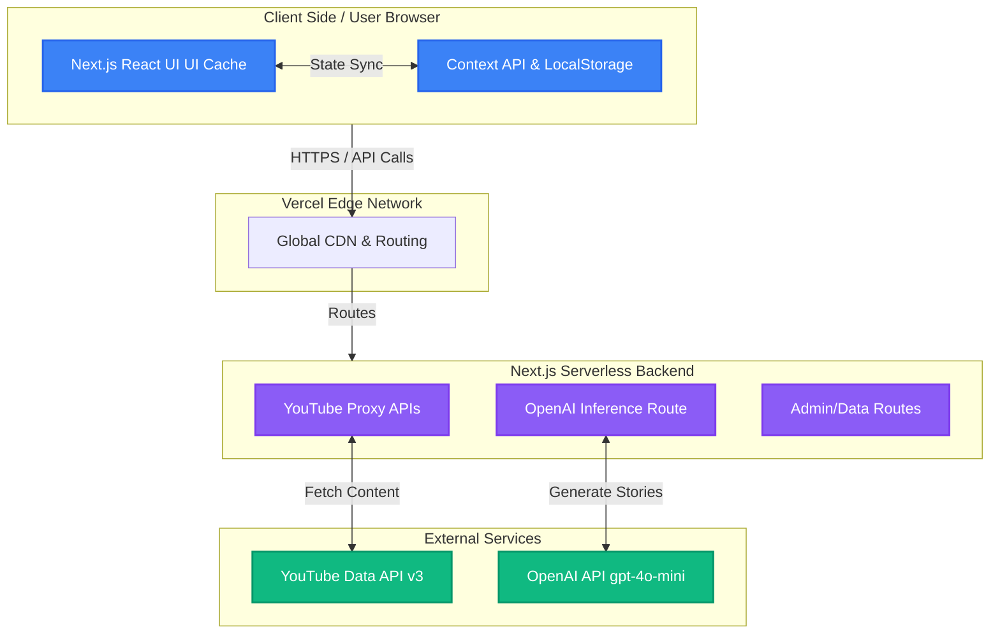
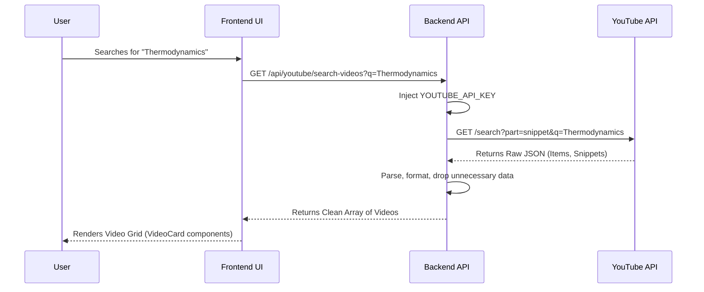
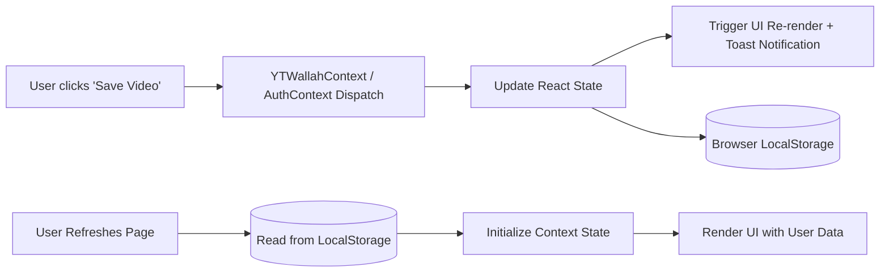
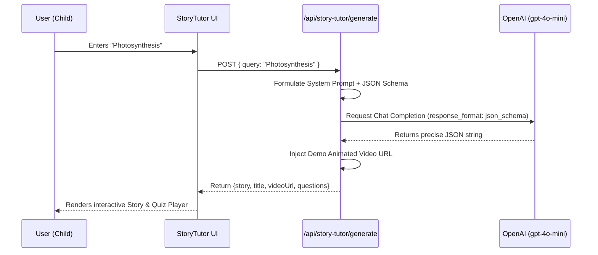

# PW StudyVerse - Technical Architecture Documentation

## 1. Executive Summary
PW StudyVerse is a distraction-free, compliance-first educational video platform. It acts as a curated wrapper around YouTube's vast educational content, presenting it in a focused, high-performance web interface. It eliminates YouTube's recommendation algorithms and comments, offering students a pure learning environment. The platform includes a personalized library (watch history, saved videos), a dynamic Admin dashboard, and an AI-powered interactive learning tool (StoryTutor).

---

## 2. High-Level Architecture Diagram

The system operates on a modern **Serverless/Edge Architecture** using Next.js. 

---

## 3. Technology Stack

* **Frontend Framework**: Next.js 15 (App Router)
* **UI Library**: React 18
* **Styling**: Tailwind CSS, Framer Motion (Animations)
* **Icons**: Lucide React
* **State Management**: React Context API (`AuthContext`, `YTWallahContext`)
* **Persistence (Database/Storage)**: LocalStorage (Browser-based persistence for hackathon prototype agility)
* **Backend API**: Next.js Route Handlers (Serverless APIs)
* **External APIs**: 
  * YouTube Data API v3 (Search, Videos, Channels, Playlists)
  * OpenAI API (`gpt-4o-mini` with Structured Outputs)
* **Hosting/Deployment**: Vercel

---

## 4. Core Workflows & Data Flow

### 4.1 Content Ingestion (YouTube API Flow)

To protect API keys and handle CORS, the client never talks to YouTube directly. All requests proxy through our Next.js API.

### 4.2 User State & Virtual Library (Local Storage)

Instead of a heavy relational database, the prototype relies on robust client-side storage for the "Digital Backpack" features (Watch History, Saved Videos, Custom My Channels list).

### 4.3 AI StoryTutor (OpenAI Integration)

The StoryTutor feature takes a user query and returns a fully structured educational JSON object containing a story, title, and multiple-choice quizzes.

---

## 5. Sub-system Configurations

### 5.1 The Admin Control Panel (`/admin`)
* **Purpose**: Centralized dashboard to manage the curated experience.
* **Capabilities**: 
  * Add/Remove Global Channels (`/admin/channels`)
  * Broadcast Announcements (`/admin/announcements`)
  * Manage Study Notes (`/admin/study-notes`)
  * Site Settings (`/admin/settings` - toggle features, update API keys)
* **Architecture**: Secure routes checking `isAdminAuthenticated` state. Actions update global contexts which sync down to `siteSettings` and `channels` storage objects.

### 5.2 Next.js App Router Structure
* `/` - Master dashboard landing page
* `/channels` & `/channel/[id]` - Directory traversing and specific channel proxy viewers.
* `/my-channels` - User-curated list of saved channels + global search.
* `/library` & `/watch/[id]` - User's private ecosystem (history, saved videos) and the distraction-free video player.
* `/live` - Specifically filters fetched channel content, throwing out VODs and mapping only `isLive === true` and `isUpcoming === true` events.

---

## 6. Security & Performance Considerations

1. **API Key Obfuscation**: The YouTube and OpenAI API keys sit exclusively on Vercel's server environment variables. The client never exposes them.
2. **Rate Limiting Protection**: `ChannelSearch` and `VideoSearch` implement debouncing (`setTimeout` for 500ms) to prevent flooding the backend / YouTube API on every keystroke.
3. **Fast Navigation**: Next.js `Link` components prefetch routes, ensuring instant transitions between the Library, Live, and Channel views.
4. **Client-Side Rendering (CSR) vs Server-Side Rendering (SSR)**: Due to the high reliance on `localStorage` for the user's specific curated channels and watch history, many components are wrapped in `"use client"` directives with hydration checks (`mounted` flags) to prevent hydration mismatches.